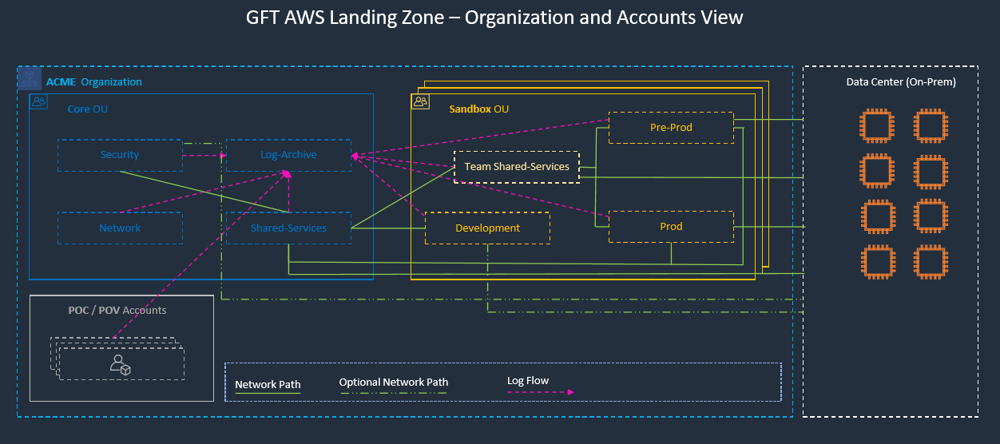
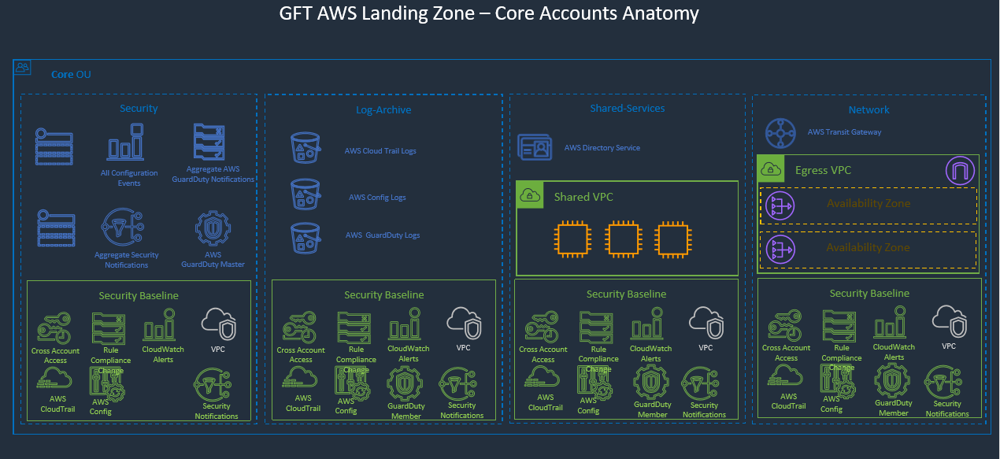
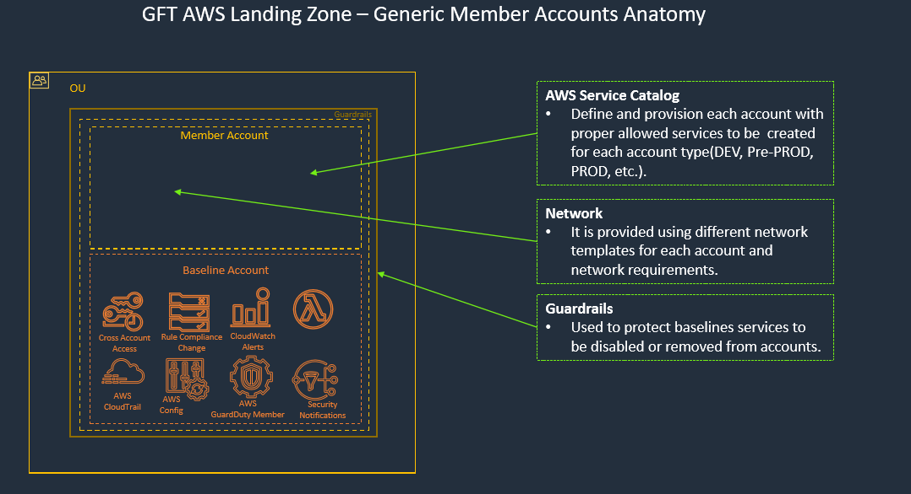
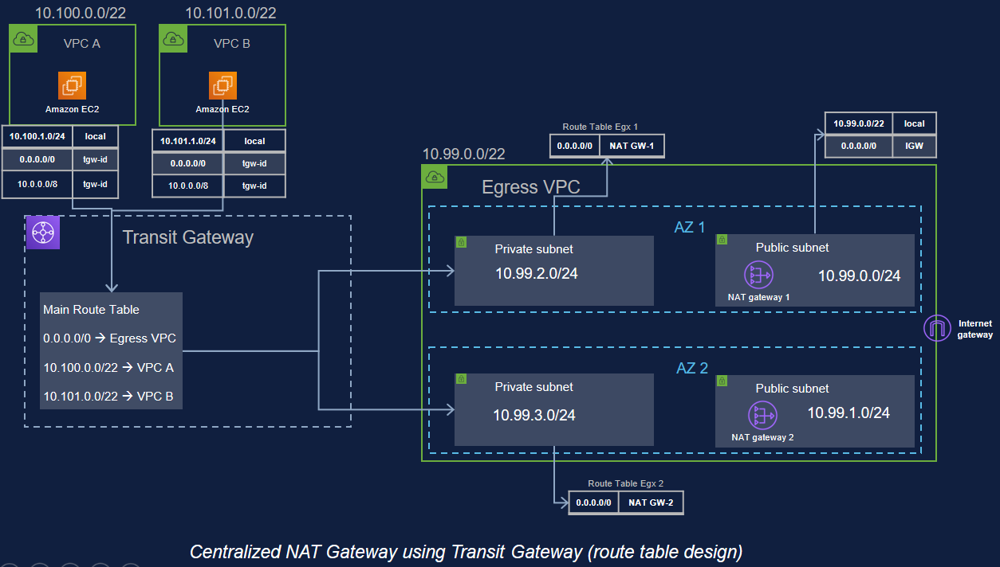
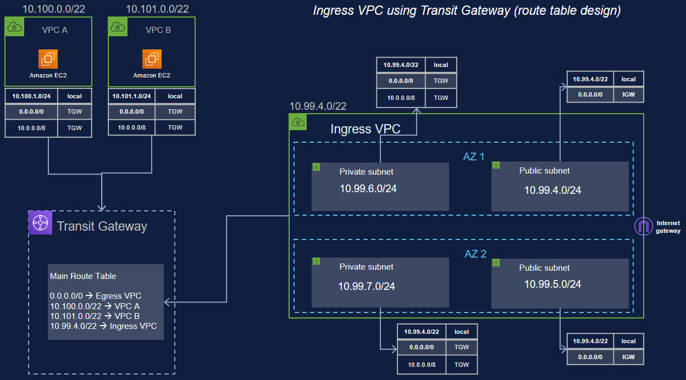
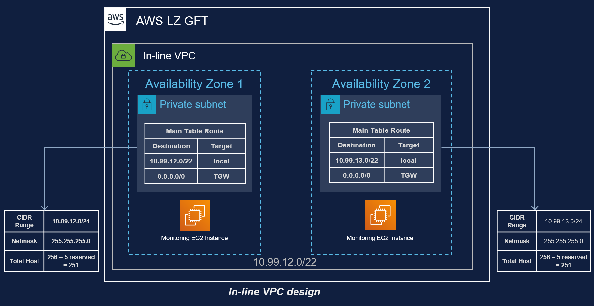
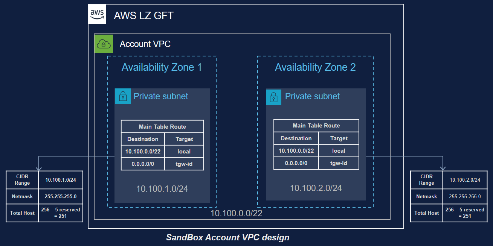
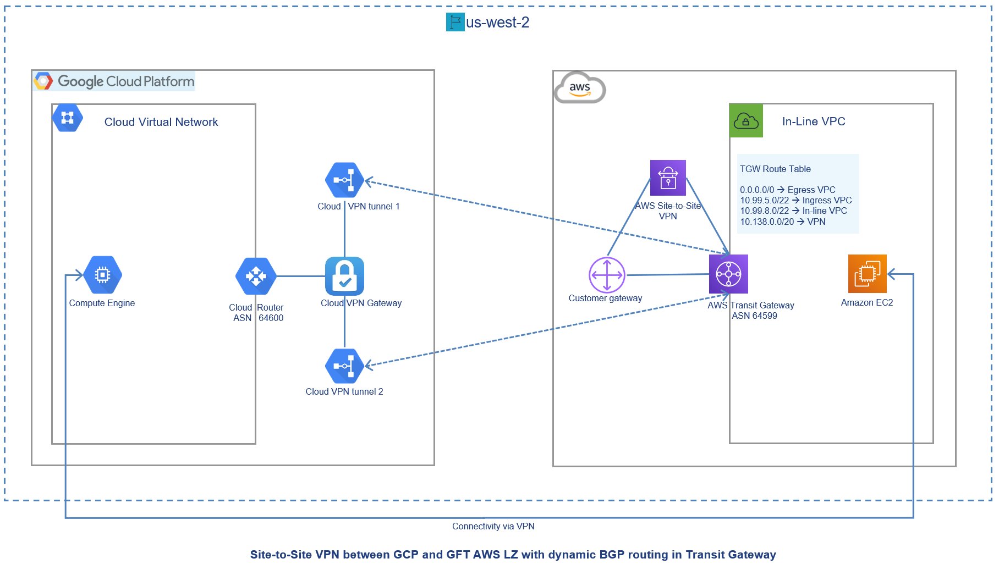

# AWS Landing Zone - Tranquility Base

  * [Overview](#overview)
  * [Organization](#organization)
    + [Organization, organizations units and accounts](#organization--organizations-units-and-accounts)
    + [Core Organization Unit and its core components anatomy](#core-organization-unit-and-its-core-components-anatomy)
    + [Generic account anatomy](#generic-account-anatomy)
    + [Account Creation in LZ](#account-creation-in-lz)
  * [Network](#network)
    + [Current Network Infrastructure](#current-network-infrastructure)
    + [Egress VPC Network Diagram](#egress-vpc-network-view)
    + [Ingress VPC Network Diagram](#ingress-vpc-network-view)
    + [In-Line VPC Network Diagram](#in-line-vpc-network-view)
    + [SandBox Account Structure](#sandbox-account-vpc)
    + [Cloud-to-Cloud VPN connection between AWS & GCP](#site-to-site-vpn-connection-between-gcp-and-aws-transit-gateway-with-dynamic-bgp-routing)
    + [CIDR Table Reference](#cidr-table-reference)
  * [Code Blueprints](#code-blueprints)
    + [Infrastructure as code Development](#infrastucure-as-code-development)
    + [Directory Structure](#directory-structure)
    + [Local / Remote Execution sequence steps](#local---remote-execution-sequence-steps)
    + [Coding standards and naming conventions](#coding-standards-and-naming-conventions)
  * [Modules](#modules)
    + [Module references](#module-reference)
    + [Module dependencies](#module-dependencies)
  
## Overview
Landing zone solution helps to save time by re-using best practices for AWS cloud. Multi-account strategy is an enabler of secure and scalable workloads providing:

- Identity and access management
- Governance
- Data security
- Robust networking
- Logging

## Organization

### Organization, organizations units and accounts


### Core Organization Unit and its core components anatomy 


### Generic account anatomy



### Account Creation in LZ
There are different approaches for accomplish this however we consider that one of the most effective is **AVM** (_Account Vending Machine_) for the following reasons:

- Isolates - It can be deployed as a separate and individual workload
- Decoupled  - There is no dependency with the LZ however it depends on other AWS Services
- Repeatable - Each account is a template and can be applied over different accounts, useful for mid-size companies that divide groups in more than one account.
- Easy for modify - Based on clear phases applied over an account it is easy to modify the process, however we must be careful due to different version of baseline account can drive to vulnerabilities (*).

Some of the pitfalls that we found are:

- Add or remove in a tailored fashion components is not part of the main use cases. That mean after you got it is hard to change it.
- AWS dependencies on Cloud Formation and Service Catalog. There is no alternative for replacing those using this approach.
- Currently Control Tower can do it however baseline accounts will differ so we can be in the scenario described before (*). 

_There are different flavors on implementations but all have point described above in common._

## Network

### Current Network Infrastructure


### Egress VPC Network View



### Ingress VPC Network View



### In-Line VPC Network View



### Sandbox Account VPC 



### CIDR Table reference
| Network    			|     CIDR  	     | 
| --------------------- |:------------------:| 
|Egress			        | **10.99.0.0/22** 	 |
|                       | 10.99.0.0/24       | 
|                       | 10.99.1.0/24       |
|                       | 10.99.2.0/24       |
|                       | 10.99.3.0/24       |
|                       |                    |
|Ingress    	        | **10.99.4.0/22** 	 |
|                       | 10.99.4.0/24       |
|                       | 10.99.5.0/24       |
|                       | 10.99.6.0/24       |
|                       | 10.99.7.0/24       |
|                       |                    |
|In-Line                | **10.99.12.0/22**  |
|                       | 10.99.12.0/24      |
|                       | 10.99.13.0/24      |
|-----------------------|--------------------|

| Shared Services		| 10.99.08.0/22      | 
| --------------------- |:------------------:| 
|Private Subnets        | 10.99.08.0/24      |
|                       | 10.99.09.0/24      |
|                       |                    |
|EKS Cluster            | **10.99.16.0/22**  |
|                       | 10.99.16.0/24      |
|                       | 10.99.17.0/24      |
|                       | 10.99.18.0/24      |
|                       | 10.99.19.0/24      |
| --------------------- | -------------------|

| Security      		| 10.99.20.0/22      | 
| --------------------- |:------------------:| 
|Private Subnets        | 10.99.20.0/24      |
|                       | 10.99.21.0/24      |
| --------------------- | -------------------|

| SandBox 1      		| 10.100.0.0/22      | 
| --------------------- |:------------------:| 
|Private Subnets        | 10.100.0.0/24      |
|                       | 10.100.1.0/24      |
| --------------------- | -------------------|

| SandBox 2      		| 10.101.0.0/22      | 
| --------------------- |:------------------:| 
|Private Subnets        | 10.101.0.0/24      |
|                       | 10.101.1.0/24      |
| --------------------- | -------------------|

### Site-to-Site VPN connection between GCP and AWS Transit Gateway with dynamic BGP routing.



Read more [**here**](./automation/docs/vpn_aws_gcp.pdf) about the steps to configure a VPN between AWS and GCP.

## Guidelines

### IaC Development


### Directory Structure
```  
├── terraform               
│   ├── main.tf                             [RO File Autogenerated] Entry point for Terraform
│   ├── variables.tf                        [RO File Autogenerated] Variables in TF
│   ├── output.tf                           [RO File Autogenerated] Outputs in TF
│   ├── implementations             
|   |    ├── imports.txt                    Reference of all files to be merged.
│   |    └── core
│   |         ├── security                  Directory will security elements 
│   |         |    └── security-*-.tf       
│   |         ├── logarchive                Directory will logarchive elements 
│   |         |    └── logarchive-*-.tf       
│   |         ├── sharedservices            Directory will sharedservices elements 
│   |         |    └── sharedservices-*-.tf       
│   |         ├── network                   Directory will network elements 
│   |         |    └── network-*-.tf       
│   |         ├── *-template.tf            Files to be used as modules instanciations 
│   |         ├── *-variables.tf           Files to be used as modules variables
│   |         └── *-outputs.tf             Files to be used as modules outputs
│   └── modules                            Module dirctory where you can have modules and submodules
│       ├── organizations
│       ├── common                         Services modules use by other services
│       │    ├── s3
│       │    └── iam
│       ├── config
│       └── guard-duty
├── automation
│    ├── cicd                                (CI/CD scripts)
│    │   ├── terraform-pre-run.py       
│    │   ├── prepare.sh
│    │   └── provision.sh      
│    ├── credentials                         (Credentials generated and used by scripts)
│    └── deploy                              (Deployment scripts)
└── config
     └── main.config.yml                    Main configuration
```

### Local / Remote Execution sequence steps

1 - Export your environment variables to be used by terraform
``` sh
export AWS_ACCESS_KEY_ID=[your access ID ]
export AWS_SECRET_ACCESS_KEY=[your secret key]
```

2- Execute pre run in which all files are going to be merged
``` sh
python3 automation/cicd/terrraform-pre-run.py
```

3- Execute terraform initialization command
``` sh
terraform init ./terraform
```

4- Execute terraform plan command
``` sh
terraform plan ./terraform
```

5- Execute terraform plan command
``` sh
terraform apply ./terraform
```
### Coding standards and naming conventions

* Read carefully names used in AWS LZ and try to follow the same convention. 
* Modules has to represent a module in our application. 
* Modules promotes reusability and are part of building pattern if you think that your module cannot be part of a module or your module will not be generic enough please discuss first doing any implementation of it.
* Modules with submodules is allowed but make sure if that module has to be tied with main module and not be part of more generic / common service if more than one module use it.
* Each template must have a header with a reference of what is instantiating in that block of code and it dependencies.
* Inner modules variables generic because can be used in differents intantiations
* Outter variables uses by templates must to be very specific to make reference to what is being store on them.
* Module required variables must match with Provider API values not provided can be default.
* All resources in which provider accept tags must follow our tagging convention 
* Naming for resouces in modules are the following
    ``` 
    aws_lz_[module]
    aws_lz_[sub-element]
    aws_lz_[sub-element]_[custom implementation]
    ```
* Naming for module instance is more specific to give context of it using 
    ```
        module "aws_lz_organizations_ou_core" {
    ```
* Tags conventions must to be provided in all AWS element that support them. 
    * **ProjectID**    Project ID
    * **Environment**  Environment in which that componets was created
    * **AccountID**    Account ID
    * **Key Name**     Key name to identify that item in the cloud 

    _Make sure to respect names and case_    
# Modules
## Module Reference
| Module         | Completeness  | Documentation  |
| ----------------- |:-------------:| ----------------:|
| cloudtrail        | WIP            |[README](/terraform/modules/organization/README.md)|
| config            | WIP            |[README](/terraform/modules/confg/README.md) |
| security          | WIP            |[README](/terraform/modules/security/README.md) |
| extension         | WIP            |[README](/terraform/modules/sharedservices/README.md) |
| common            | WIP            |[README](/terraform/modules/common/README.md) |
| guarddutty        | WIP            |[README](/terraform/modules/organization/README.md)|
| iam               | WIP            |[README](/terraform/modules/confg/README.md) |
| s3                | WIP            |[README](/terraform/modules/security/README.md) |
| kms               | WIP            |[README](/terraform/modules/sharedservices/README.md) |
| ram               | WIP            |[README](/terraform/modules/common/README.md) |
| organizations     | WIP            |[README](/terraform/modules/organization/README.md)|
| sns               | WIP            |[README](/terraform/modules/confg/README.md) |
| security          | WIP            |[README](/terraform/modules/security/README.md) |
| transit-gateway   | WIP            |[README](/terraform/modules/sharedservices/README.md) |


## Module dependencies 
| Module    			| common  		| shared-services  	| organizations | security 		| config 		|
| --------------------- |:-------------:| :-------------: 	|:-------------:| :------------:| -------------:|
|common					|     			|       			|       		|       		|  	     		|
|shared-services		|     			| 	     			|       		|       		|  	     		|
|security				|     			|  	     			|       		|       		|  	     		|
|organizations			|     			|  	     			|       		|       		|  	     		|
|config					|     			|       			|       		|       		|  	     		|
